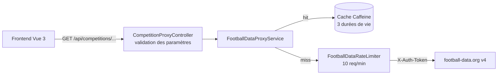

# ⚽ Dashboard Foot — Backend

API Spring Boot qui relaie [football-data.org](https://www.football-data.org/) pour le frontend [Dashboard Foot](https://github.com/foucouthibault/Dashboard-foot). Elle garde la clé d'API côté serveur, met les réponses en cache et fait respecter le quota de l'offre gratuite (10 requêtes par minute).

[](https://github.com/foucouthibault/Dashboard-foot-backend/actions/workflows/maven.yml)


## Architecture



## Endpoints

| Méthode | Route | Paramètres | Cache |
|---|---|---|---|
| `GET` | `/api/competitions/{id}` | — | 60 s |
| `GET` | `/api/competitions/{id}/standings` | `season` (optionnel, ex. `2025`) | 5 min, ou 24 h pour une saison terminée |
| `GET` | `/api/competitions/{id}/matches` | — | 60 s |
| `GET` | `/api/competitions/{id}/scorers` | `limit`, `season` (optionnels) | 5 min, ou 24 h pour une saison terminée |

`{id}` accepte un code (`FL1`, `PL`…) ou un identifiant numérique (`2015`). Un `id` qui ne correspond pas à `^[a-zA-Z0-9_-]+$` ou une `season` qui n'est pas une année sur 4 chiffres renvoient `400`.

Les réponses sont celles de football-data.org, transmises telles quelles.

## Choix techniques

- **Un quota global, pas par visiteur.** `FootballDataRateLimiter` applique une fenêtre glissante d'une minute à tous les appels sortants réels. Quand le quota est atteint, l'API répond `429` avec un en-tête `Retry-After` au lieu de se faire bloquer par football-data.org. Les réponses servies depuis le cache ne comptent pas dans le quota.
- **Un cache adapté à chaque type de donnée** (`CacheConfig`) :
  - 60 s pour les compétitions et les matchs ;
  - 5 min pour les classements et buteurs de la saison en cours ;
  - 24 h pour les saisons terminées, qui ne changent plus.
- **Seules les réponses réussies sont mises en cache.** Une erreur passagère (`429`, panne réseau) ne reste pas figée jusqu'à la fin de la durée de vie du cache.
- **Un seul appel pour tous les `limit` de buteurs.** Le service demande toujours 50 buteurs à l'API puis découpe la liste selon le `limit` demandé. Changer de `limit` côté frontend ne consomme donc jamais de quota.
- **Des erreurs transmises fidèlement.** Un statut d'erreur de l'API (saison hors offre, quota dépassé…) est renvoyé tel quel. Une panne réseau donne un `502` sans exposer le message de l'exception.
- **Sécurité :**
  - le jeton reste côté serveur ;
  - seuls les en-têtes `Accept` et `Accept-Language` du client sont relayés ;
  - les paramètres sont validés ;
  - l'URL sortante est vérifiée (même schéma, hôte et port que l'URL configurée) pour empêcher toute requête vers un autre serveur (SSRF).

## Démarrage rapide

### Prérequis

- Java 25 (Maven est fourni par le wrapper `./mvnw`)
- Une clé football-data.org ([inscription gratuite](https://www.football-data.org/client/register))

### Lancer l'application

```bash
git clone https://github.com/foucouthibault/Dashboard-foot-backend.git
cd Dashboard-foot-backend
FOOTBALL_DATA_API_TOKEN=votre_cle ./mvnw spring-boot:run
```

L'API écoute sur http://localhost:8080 :

```bash
curl http://localhost:8080/api/competitions/FL1/standings
```

Sans clé, l'application démarre quand même, mais football-data.org refusera ou limitera les appels.

Pour l'interface, lancer ensuite le [frontend](https://github.com/foucouthibault/Dashboard-foot) : son serveur de développement relaie `/api` vers ce backend.

## Configuration

Toutes les valeurs sont dans `src/main/resources/application.properties` et peuvent être surchargées par variable d'environnement ou argument `--propriete=valeur`.

| Propriété | Défaut | Rôle |
|---|---|---|
| `football-data.api.token` | variable `FOOTBALL_DATA_API_TOKEN` | Clé d'API football-data.org |
| `football-data.api.base-url` | `https://api.football-data.org/v4` | URL de l'API |
| `football-data.api.rate-limit-per-minute` | `10` | Quota d'appels sortants par minute |
| `football-data.cache.static-ttl-seconds` | `60` | Cache des compétitions et matchs |
| `football-data.cache.current-season-ttl-seconds` | `300` | Cache de la saison en cours |
| `football-data.cache.historical-season-ttl-hours` | `24` | Cache des saisons terminées |
| `server.port` | `8080` | Port HTTP |

## Tests

```bash
./mvnw test
```

29 tests, qui ne demandent ni clé d'API ni accès réseau (l'API est simulée) :

- **Contrôleur** : rejet des identifiants invalides (caractères spéciaux, `/`, injection SQL, remontée de répertoire) et transmission des paramètres.
- **Service** :
  - utilisation du cache, et une clé de cache par saison ;
  - choix du bon cache selon la saison ;
  - erreurs non mises en cache ;
  - transmission des statuts d'erreur ;
  - `429` quand le quota est atteint ;
  - découpage des buteurs.
- **Limiteur de débit** : quota dans la fenêtre, libération des places, calcul de `Retry-After`. Le temps est simulé avec une `Clock` injectée.

La CI GitHub Actions compile le projet et lance les tests à chaque push et chaque pull request. Dependabot maintient les dépendances à jour.

## Structure du projet

```
src/main/java/com/example/Dashboard_foot/
├── config/
│   ├── AppConfig.java                  # RestTemplate
│   └── CacheConfig.java                # Les trois caches Caffeine
├── controller/
│   └── CompetitionProxyController.java # Routes /api/competitions et validation
└── service/
    ├── FootballDataProxyService.java   # Appel à l'API, cache, erreurs, sécurité SSRF
    └── FootballDataRateLimiter.java    # Limite de débit à fenêtre glissante
```

## Limites connues et pistes

- **Cache et quota en mémoire.** Ils sont perdus au redémarrage et propres à chaque instance. Piste : un cache persistant (PostgreSQL ou Redis).
- **Saison terminée ou en cours ?** Le calcul se fait à partir de l'année civile, donc il est approximatif en juillet-août. Au pire, une saison encore active reste en cache un peu plus longtemps que nécessaire.
- **Pas de modèle de données.** Les réponses sont transmises en JSON brut. Pistes : des objets de réponse typés et une documentation OpenAPI.
- **Pas de configuration CORS.** Le frontend passe aujourd'hui par le proxy Vite. Pour un déploiement sur deux domaines différents, il faudra autoriser l'origine du frontend.
